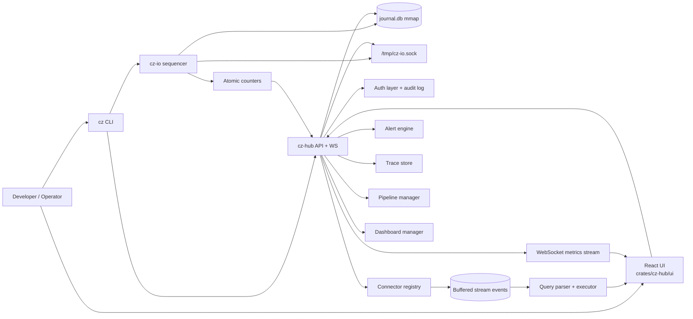
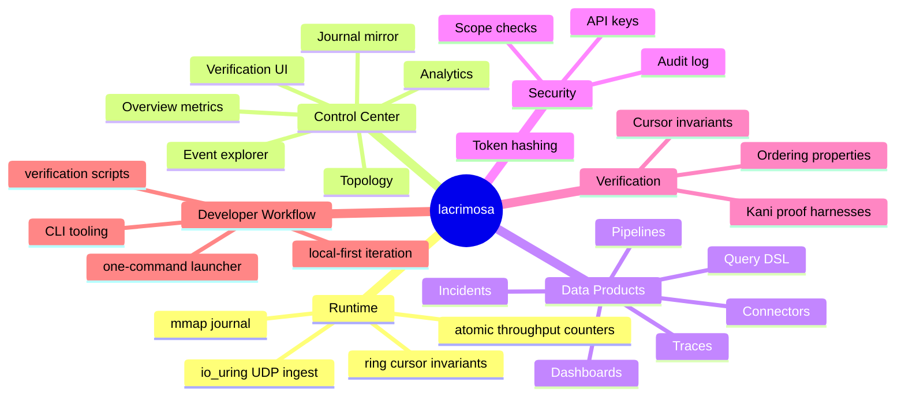
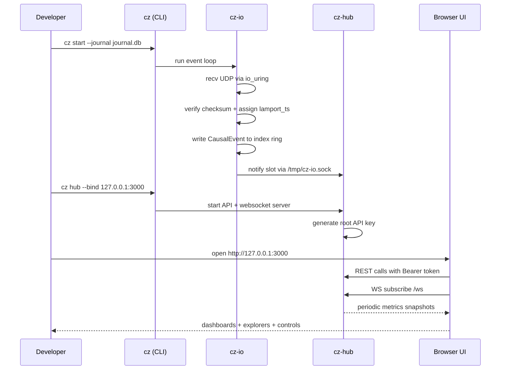
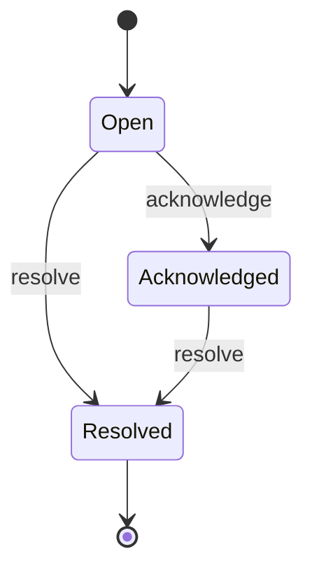
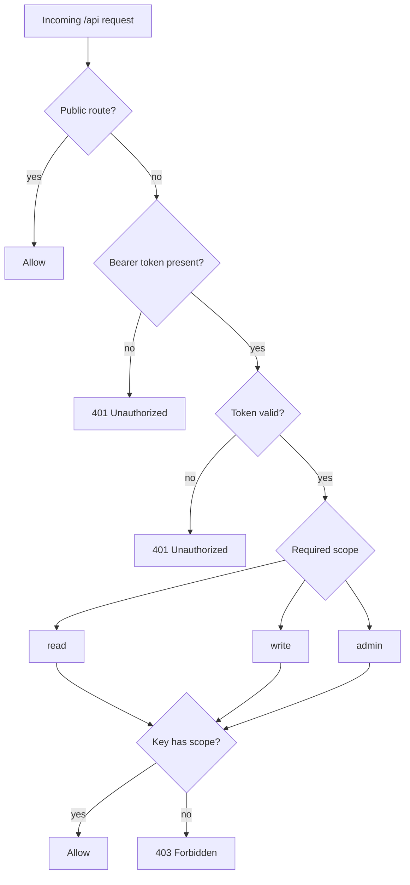

# lacrimosa

`lacrimosa` is a local-first observability and operations control center for a high-throughput sequencer runtime.

At a glance, this repository gives you a complete vertical slice:
- a deterministic event model (`cz-core`)
- a memory-mapped + `io_uring`-driven ingest engine (`cz-io`)
- formal verification harnesses (`cz-verify`)
- an API + websocket backend and UI host (`cz-hub`)
- a command-line interface for operating the stack (`cz-cli`)
- a one-command launcher script (`lacrimosa`)

This README is intentionally long and detailed. The goal is to let a new developer open this repo and become productive without hunting through source files first.

---

## 1. What This Project Is

`lacrimosa` is built as a local control plane for event sequencing and runtime inspection. It is not only a dashboard. It combines:
- ingest runtime behavior
- journaling internals
- stream/event exploration
- query/search
- traces and service dependency visualization
- alert/incident management
- pipeline and dashboard editors
- API key auth and audit logging
- formal verification entry points

The system is opinionated toward development and debugging workflows where immediate, low-latency visibility into runtime state matters more than long-term historical warehousing.

### Design intent

The codebase strongly emphasizes three constraints:
1. Deterministic event ordering.
2. Low-copy / low-overhead I/O paths.
3. Operability from a single machine with minimal setup.

### What it is not

- Not a distributed control plane orchestrator.
- Not a long-term analytics data warehouse.
- Not yet a complete production SaaS surface (several modules are intentionally MVP-level).

---

## 2. Visual System Map

### High-level architecture graph



### Mind map of repo capabilities



### Runtime request/telemetry sequence



---

## 3. Repository Layout

```text
.
├── Cargo.toml                   # Workspace definition
├── README.md                    # This document
├── DEMO.md                      # Demo-oriented quick walkthrough
├── lacrimosa                    # One-command launcher script
├── verify_auth.sh               # Auth verification script
├── verify_cli.sh                # CLI verification script
├── verify_dashboards.sh         # Dashboard CRUD verification script
├── crates/
│   ├── cz-core/                 # Event model + ordering semantics
│   ├── cz-verify/               # Kani formal proofs
│   ├── cz-io/                   # Sequencer engine + journal I/O
│   ├── cz-cli/                  # Operational CLI binary (cz)
│   └── cz-hub/                  # API/WebSocket backend + static UI host
│       └── ui/                  # React/Vite frontend
└── doc/
    └── control-center-decisions.md
```

Workspace members are defined in `Cargo.toml` and intentionally separated by responsibility.

---

## 4. Core Concepts and Data Model

### 4.1 `CausalEvent` (the event atom)

`cz-core` defines `CausalEvent`, the fundamental event unit. It is `#[repr(C)]` and sized to 32 bytes, with deterministic field layout suitable for zero-copy and stable binary handling.

Key fields:
- `lamport_ts: u64`
- `node_id: u32`
- `stream_id: u16`
- `flags: u16`
- `payload_offset: u64`
- `checksum: u32`

Ordering is explicitly implemented as:
- `(lamport_ts, node_id, stream_id)`

Notably, payload location and checksum are *not* part of ordering semantics.

### 4.2 Journal layout (`journal.db`)

`cz-io` models the journal as a single memory-mapped file split into two regions:
- Index ring (fixed-size `CausalEvent` slots)
- Blob storage (variable payload bytes)

This supports direct pointer-based write/read paths without object-heavy transformations.

### 4.3 Cursor invariants

The ring cursor tracks head/tail and enforces the no-overwrite invariant for unconsumed data. The cursor module includes Kani proofs for invariants and consistency behavior.

---

## 5. Deep Dive by Crate

## 5.1 `crates/cz-core`

Purpose:
- define low-level event structure and ordering semantics
- provide construction helpers and flags
- keep the core runtime data representation minimal and deterministic

What matters for contributors:
- if you change ordering logic, you are changing system semantics
- keep field-level compatibility concerns front of mind
- tests in this crate validate size assumptions and ordering behavior

## 5.2 `crates/cz-verify`

Purpose:
- provide formal verification harnesses using Kani
- prove ordering properties, not just sample-based test outcomes

Current proof themes include:
- monotonicity after sorting
- transitivity
- antisymmetry

Practical note:
- proofs are gated under `cfg(kani)` and run via `cargo kani --package cz-verify`

## 5.3 `crates/cz-io`

Purpose:
- network ingress and sequencing engine
- direct UDP receive flow using `io_uring`
- write sequenced events into memory-mapped journal ring

Highlights:
- pipelined receives with fixed in-flight depth
- checksum verification on payload
- global atomic counters for telemetry
- optional IPC broadcast to notify observers of new slots

Why this matters:
- this is the performance-sensitive center of the system
- correctness and throughput tradeoffs are concentrated here

## 5.4 `crates/cz-cli`

Purpose:
- operator and developer entrypoint for runtime commands

Main commands:
- `start`: boot sequencer event loop
- `verify`: run formal verification commands
- `status`: print runtime status JSON
- `hub`: launch control center backend
- `lacrimosa`: combined startup flow
- `connectors`, `query`, `tail`, `incidents`, `traces`: API-facing convenience commands

## 5.5 `crates/cz-hub`

Purpose:
- host REST and websocket APIs
- expose operational and observability modules
- serve static frontend assets

Built-in modules:
- connector registry
- query parser/executor
- alerts/incidents
- traces + service graph
- pipelines
- dashboards
- auth + audit

Auth model:
- API key-based bearer auth
- startup root key generation
- scope-aware enforcement (`read`, `write`, `admin`)

## 5.6 `crates/cz-hub/ui`

Purpose:
- interactive UI for metrics, exploration, and control

Navigation surfaces include:
- Overview
- Connectors
- Query Console
- Event Explorer
- Traces
- Pipelines
- Dashboards
- Topology
- Analytics
- Journal Mirror
- Incidents
- Verification
- Settings

---

## 6. API Surface Overview

The hub defines a broad API map. Core families include:

### 6.1 Runtime and metrics
- `GET /api/status`
- `GET /api/system`
- `GET /api/metrics/history`
- `GET /api/ring`
- `GET /metrics` (Prometheus text format)
- `GET/POST /api/playback`
- `POST /api/replay`

### 6.2 Event and export endpoints
- `GET /api/events`
- `GET /api/events/{slot}`
- `GET /api/export`
- `POST /api/simulate`
- `POST /api/verify`

### 6.3 Topology and stream introspection
- `GET /api/topology`
- `GET /api/streams`
- `GET /api/journal/layout`

### 6.4 Connectors and query
- `GET/POST /api/connectors`
- `DELETE /api/connectors/:id`
- `POST /api/connectors/:id/ingest`
- `POST /api/query`

### 6.5 Alerts/incidents
- `GET /api/alerts`
- `GET/POST /api/alerts/rules`
- `POST /api/alerts/rules/v2`
- `GET /api/alerts/incidents`
- `POST /api/alerts/incidents/test`
- `POST /api/alerts/incidents/:id/acknowledge`
- `POST /api/alerts/incidents/:id/resolve`

### 6.6 Traces
- `GET /api/traces`
- `POST /api/traces/ingest`
- `GET /api/traces/:id`
- `GET /api/traces/service-graph`

### 6.7 Pipelines
- `GET/POST /api/pipelines`
- `GET/PUT/DELETE /api/pipelines/:id`
- `POST /api/pipelines/:id/run`
- `POST /api/pipelines/:id/stop`

### 6.8 Dashboards
- `GET/POST /api/dashboards`
- `GET/PUT/DELETE /api/dashboards/:id`

### 6.9 Auth and audit
- `GET/POST /api/auth/keys`
- `DELETE /api/auth/keys/:id`
- `GET /api/auth/audit`

---

## 7. Auth and Security Model

`lacrimosa` uses API keys with SHA-256 hashing and constant-time comparison for token validation.

### Scope behavior

- `/api/status` is intentionally public.
- `/api/auth/*` requires `admin`.
- `GET/HEAD` API calls require `read`.
- mutating calls require `write`.
- `admin` supersedes lower scopes.

### Startup key behavior

On hub startup, a root key is generated and printed in logs once. The UI expects this key to be pasted into the auth modal and persists it in local storage for future calls.

### Audit

Key management actions are logged to an in-memory audit ring.

---

## 8. Query DSL and Data Exploration

The query subsystem includes parser + executor modules.

Supported shape (SQL-like):

```text
SELECT * FROM stream_a, stream_b WHERE field > 100 AND status = "ok" SINCE 5m LIMIT 50 OFFSET 0
```

Supported operators include:
- `=` `!=` `>` `>=` `<` `<=`
- `CONTAINS`
- `STARTSWITH`

Temporal filtering supports:
- RFC3339 timestamps
- relative offsets (`s`, `m`, `h`, `d`)

Execution model:
- query runs over connector registry buffered events
- stream filters apply first
- condition filters apply second
- temporal filters and pagination apply afterward

---

## 9. Traces, Pipelines, and Dashboards

## 9.1 Traces

Trace ingestion accepts spans and builds:
- grouped traces by `trace_id`
- root span detection
- duration and service set summaries
- simple service dependency graph

Search filters include:
- service
- operation
- min duration
- since timestamp
- limit

## 9.2 Pipelines

Pipeline representation is graph-shaped:
- `nodes`: typed processing elements (`source`, `filter`, `transform`, `join`, `aggregate`, `sink`)
- `edges`: directional links

Current manager functionality supports CRUD + run/stop state toggles + graph updates.

## 9.3 Dashboards

Dashboards support layout + widget composition. Widget families currently include:
- time series
- single value
- table
- log stream

The current UI stores and edits dashboard structures and layout metadata through REST.

---

## 10. UI Pages and Intended Usage

### Overview
Best first stop. Shows throughput trends, ring utilization, and high-level health.

### Event Explorer
Use for slot-level event inspection including payload details and navigation across event pages.

### Connectors
Create and manage connector instances; useful for onboarding webhook streams and (feature-gated) broker connectors.

### Query Console
Run ad-hoc DSL queries over buffered stream events.

### Traces
Inspect trace groups and cross-service relationships at a glance.

### Pipelines
Graph editor workflow for defining stream composition logic.

### Dashboards
Custom arrangement space for widgets and team-specific monitoring views.

### Incidents
Track open/acknowledged/resolved incidents and lifecycle transitions.

### Verification
Kick off verification-oriented checks from UI workflows.

### Settings
Environment-level preferences and UI behavior toggles.

---

## 11. Launch and Operation Workflows

## 11.1 One-command launch

From repo root:

```bash
./lacrimosa
```

If `lacrimosa` is installed into your PATH as a command, you can use:

```bash
lacrimosa
```

What it does:
- optionally rebuilds frontend when stale
- builds Rust binaries when requested
- starts sequencer process in background
- launches hub foreground process on `127.0.0.1:3000`
- prints root API key to logs

## 11.2 Manual launch

Terminal A:

```bash
cargo run -p cz-cli -- start --journal journal.db
```

Terminal B:

```bash
cd crates/cz-hub/ui
npm install
npm run build
cd ../..
cargo run -p cz-hub
```

Browser:
- open `http://127.0.0.1:3000`
- paste startup root key into auth modal

## 11.3 Generate test traffic

```bash
echo "LACRIMOSA-DATA-PAYLOAD" | nc -u -w1 127.0.0.1 9000
```

Without traffic, many dashboards and counters will remain near zero.

---

## 12. Development Workflow

Typical inner loop:

1. edit Rust or UI code
2. run checks
3. run local stack
4. inspect UI + APIs
5. run verification scripts

Useful commands:

```bash
# Rust workspace
cargo check --workspace
cargo test --workspace -- --quiet

# Frontend
cd crates/cz-hub/ui
npm run build

# Verification scripts (from repo root)
./verify_auth.sh
./verify_cli.sh
./verify_dashboards.sh
```

---

## 13. Built-in Verification Scripts

The repository includes script-based smoke validation:

- `verify_auth.sh`
  - boots hub
  - extracts startup key
  - checks auth-protected routes
  - creates and revokes API keys

- `verify_cli.sh`
  - boots hub
  - drives selected CLI commands against live API

- `verify_dashboards.sh`
  - boots hub
  - authenticates with startup key
  - verifies dashboard CRUD flow

These scripts are practical confidence checks for local regressions.

---

## 14. Known Limitations and Sharp Edges

This section is intentionally candid.

- Connector types are not equally mature.
- Some connector integrations (Kafka/NATS) are feature-gated and include scaffold behavior.
- HTTP polling connector is explicitly not implemented yet.
- Dashboard widget rendering is currently more structural than analytics-rich in several paths.
- Notification channels in incident dispatch include TODO placeholders for external APIs.
- Auth UX depends on startup logs for first key retrieval.
- API key prefix remains `cz_` for compatibility with existing internals.
- Local storage is used for UI auth token persistence.

Treat this repository as a strong foundation with active productization gaps, not a fully hardened production platform.

---

## 15. Extension Playbooks

## 15.1 Add a new connector kind

Suggested steps:
1. implement `StreamConnector` trait in a new module
2. define connector-specific config parsing
3. wire constructor into `ConnectorRegistry::create_from_config`
4. expose creation flow via UI connector wizard
5. add script coverage where practical

## 15.2 Extend query language

Suggested steps:
1. add parse rule in `query/parser.rs`
2. add eval behavior in `query/executor.rs`
3. add parser tests
4. update Query Console docs/examples

## 15.3 Add dashboard widget type

Suggested steps:
1. add enum variant in `dashboards/mod.rs`
2. update UI widget editing/render controls
3. ensure persisted shape round-trips via API

## 15.4 Improve trace analytics

Suggested steps:
1. enrich span ingestion normalization
2. expand query params (error-only, percentile windows, etc.)
3. add UI-focused derived metrics per trace

---

## 16. Incident Lifecycle Visual



---

## 17. Scope Enforcement Visual



---

## 18. Practical Onboarding Checklist

For a developer opening this repo for the first time:

1. Confirm toolchain:
   - Rust (cargo)
   - Node + npm
2. Build workspace:
   - `cargo check --workspace`
3. Build UI:
   - `cd crates/cz-hub/ui && npm install && npm run build`
4. Launch stack:
   - `./lacrimosa`
5. Open browser at `http://127.0.0.1:3000`
6. Paste startup API key from logs
7. Generate traffic with `nc` command
8. Validate incident/query/dashboard pages
9. Run verification scripts

If all nine steps pass, your local environment is healthy.

---

## 19. Troubleshooting Guide

## 19.1 Blank UI or black screen

- Ensure UI assets exist: `crates/cz-hub/ui/dist/index.html`
- Rebuild UI: `npm run build` in `crates/cz-hub/ui`
- Hard-refresh browser cache
- Verify server logs for frontend runtime errors

## 19.2 Unauthorized status in UI

- You likely have no valid key in local storage.
- Copy startup root key from hub logs (`GENERATED ROOT API KEY`).
- Paste key in UI auth modal and save.

## 19.3 No live metrics movement

- Sequencer may not be running.
- No UDP traffic may be arriving.
- Send sample payload using `nc` and watch counters.

## 19.4 Port binding conflicts

- stop stale processes (`pkill -f cz-hub`, `pkill -f "cz start"`)
- relaunch with fresh bind settings if needed

## 19.5 API route returns 403

- key is valid but lacks required scope for operation
- use admin/root key or create key with appropriate scopes

---

## 20. Performance and Operational Notes

- The architecture relies on memory-mapped I/O and in-memory rings for speed.
- Prometheus export is intentionally lightweight.
- Some UI pages are polling-based while core telemetry is websocket-streamed.
- Metrics and history are currently best-effort local observability, not immutable historical analytics.

For production hardening, likely next steps include:
- persistent historical metrics storage
- structured log ingestion pipelines
- role-based user model beyond API keys
- stronger lifecycle orchestration for multiprocess startup
- broader test automation beyond script-level smoke checks

---

## 21. Why This Repo Is Structured This Way

This repository is intentionally modular rather than monolithic. The separation between `cz-core`, `cz-io`, `cz-hub`, `cz-cli`, and `cz-verify` helps you reason about:
- correctness boundaries
- runtime boundaries
- interface boundaries
- verification boundaries

That modularity is not only architectural style. It supports safer evolution:
- event semantics can evolve with explicit core constraints
- I/O internals can optimize independently from UI
- auth/query/dashboard features can iterate at API boundary level
- formal methods can remain a first-class artifact instead of afterthought docs

In short, `lacrimosa` is designed to be understandable in layers:
- bytes and ordering at the bottom
- ingress and persistence in the middle
- operator experience and diagnostics at the top

If you keep that layering in mind while contributing, the codebase stays coherent.

---

## 22. Command Reference Quick Block

```bash
# One command launcher
./lacrimosa

# Sequencer only
cargo run -p cz-cli -- start --journal journal.db

# Hub only
cargo run -p cz-hub -- --bind 127.0.0.1:3000

# Build everything
cargo check --workspace
cd crates/cz-hub/ui && npm run build

# Verification smoke scripts
./verify_auth.sh
./verify_cli.sh
./verify_dashboards.sh
```

---

## 23. Final Notes

If you are here to extend `lacrimosa`, start with one narrow vertical feature and wire it through all three layers:
- backend behavior
- API shape
- UI interaction

Then add a validation script or test path so the behavior remains durable.

This project is already a capable local control center, and the architecture is strong enough to support significantly more product depth. The fastest way to improve it is to preserve the existing module boundaries while making each page more actionable and each API more explicit.

If you want a concrete next-step roadmap, begin with:
1. richer incident automation and notification delivery
2. dashboard widgets with real query-backed rendering
3. connector maturity and ingestion reliability features
4. stronger end-to-end tests across auth + telemetry + UI workflows
